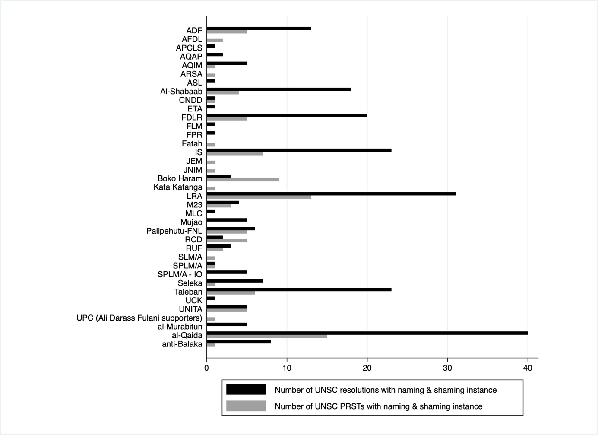
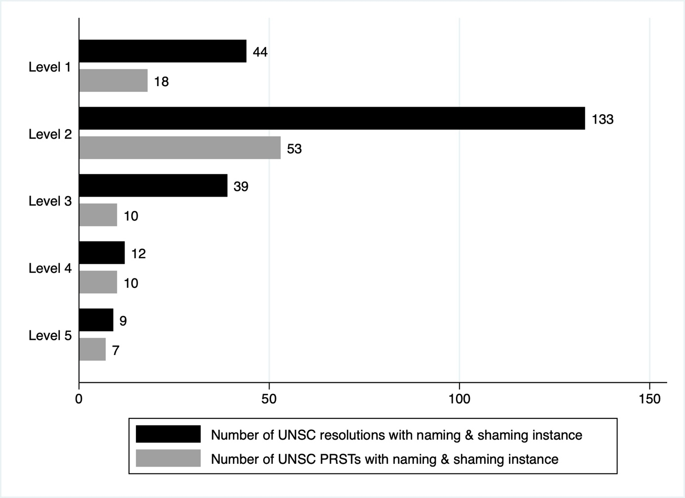

**Codebook: Naming & Shaming Rebel Groups Dataset**

**Introduction**

This Codebook introduces new data on naming & shaming rebel groups. The
Codebook has been developed during my investigation, raising the
question of how naming & shaming rebel groups impacts rebel violence
against civilians. However, to my knowledge, there is no dataset on
individual instances during which rebel groups have been named & shamed.
This is likely due to the fact that existing research on naming &
shaming predominantly focuses on governments (e.g., Allen & Bell, 2022;
Allendoerfer et al., 2020; Haines et al., 2020; Murdie & Peksen, 2014,
2015; Kahn-Nisser, 2021) and as such, valuable data collection efforts
have been conducted on naming & shaming governments (e.g. Kahn-Nisser,
2019; Meernik et al., 2012; Murdie & Davis, 2012; Hendrix & Wong, 2014).
However, in intra-state armed conflicts, rebel groups play a crucial
role (Cunningham et al., 2009) and are frequently named & shamed by
international organizations (Squatrito et al., 2019).

Recently, Benson & Tucker (2022) published a dataset on UN peacekeeping
and actor sentiments, including instances in which governments and rebel
groups have been publicly condemned. Their contribution greatly benefits
researchers interested in studying dynamics at the conflict-level, but
the dataset does not allow an attribution to specific rebel groups. As
such, we do not know which particular rebel group has been named &
shamed. Considering that the majority of governments is challenged by
more than one rebel group (see Davies et al., 2022; Harbom et al.,
2008), collecting data for each individual rebel groups is crucial to
make inferential claims. Therefore, I decided to gather and share data
on rebel group naming & shaming instances based on a dyadic structure.

This dataset provides information on rebel groups that have been named &
shamed by the UN Security Council (UNSC) between the years 1989 and
2021. It covers 365 rebel groups across 79 countries.[^1] The unit of
analysis is the rebel-group-month. The dataset is compatible with the
commonly employed datasets published by the UCDP and enables researchers
to analyze the causes and consequences of naming & shaming rebel groups.
In Table I, the variables and their respective description can be found.
In the subsequent sections, I will elaborate on the coding criteria and
the data collection process.

Table I. Variables in the Naming & Shaming Rebel Groups Dataset

+----------------------+-----------------------------------------------+
| **Variable**         | **Description**                               |
+======================+===============================================+
| side_b               | The name of the rebel group. In most cases,   |
|                      | it is the abbreviation.                       |
+----------------------+-----------------------------------------------+
| side_b_id            | This code uniquely identifies the rebel group |
|                      | and is compatible with the commonly adopted   |
|                      | UCDP datasets.                                |
+----------------------+-----------------------------------------------+
| coun                 | This is the country name in which the rebel   |
| try_name_rebelshamed | group targeted civilians and has been shamed  |
|                      | for.                                          |
|                      |                                               |
|                      | The country cell can have several country     |
|                      | names, but the cell can also be empty if the  |
|                      | country name has not been mentioned in the    |
|                      | UNSC document. If the country cell is empty   |
|                      | or several country names are stated, the      |
|                      | country of origin may be used for further     |
|                      | analysis.                                     |
+----------------------+-----------------------------------------------+
| UNSC_document        | This is the unique document published by the  |
|                      | UN Security Council.                          |
|                      |                                               |
|                      | -   "RES": Resolution                         |
|                      |                                               |
|                      | -   "PRST": Presidential Press Release        |
|                      |     Statements                                |
+----------------------+-----------------------------------------------+
| UNSC_resolution      | Dummy variable with a one indicating that the |
|                      | rebel group has been named & shamed in a UNSC |
|                      | resolution.                                   |
+----------------------+-----------------------------------------------+
| UNSC_PRST            | Dummy variable with a one indicating that the |
| (presidential press  | rebel group has been named & shamed in a UNSC |
| release statement)   | Presidential Press Release Statement.         |
+----------------------+-----------------------------------------------+
| date                 | The specific date on which the UN Security    |
|                      | Council document has been published.          |
+----------------------+-----------------------------------------------+
| year                 | The year during which the document has been   |
|                      | published.                                    |
+----------------------+-----------------------------------------------+
| month                | The month during which the document has been  |
|                      | published.                                    |
+----------------------+-----------------------------------------------+
| goldstein_content    | The name of the event type taken from the     |
|                      | Goldstein scale.                              |
|                      |                                               |
|                      | If there was more than one naming & shaming   |
|                      | instance within one paragraph, then the more  |
|                      | severe one (according to the Goldstein scale) |
|                      | is chosen. For example, "condemn" is more     |
|                      | severe than "concern".                        |
+----------------------+-----------------------------------------------+
| golds                | The weighted score taken from the Goldstein   |
| tein_weight_reversed | scale. (Originally, the Goldstein scale       |
|                      | indicates that the lower the weight, the      |
|                      | higher the intensity of a conflictual event.  |
|                      | For easier interpretation, the Goldstein      |
|                      | scale was reversed.)                          |
+----------------------+-----------------------------------------------+
| nami                 | The weighted scores taken from the Goldstein  |
| ng_shaming_intensity | scale are reversed and put into five          |
|                      | categories:                                   |
|                      |                                               |
|                      | -   Level 1                                   |
|                      |                                               |
|                      | ```{=html}                                    |
|                      | <!-- -->                                      |
|                      | ```                                           |
|                      | -   goldstein_content: "concern", "request",  |
|                      |     "calls for", "urge", "calls upon",        |
|                      |     "commenting", "recall"                    |
|                      |                                               |
|                      | -   goldstein_weight: 0.1, 0.2                |
|                      |                                               |
|                      | \- Level 2                                    |
|                      |                                               |
|                      | -   goldstein_content: "condemn"              |
|                      |                                               |
|                      | -   goldstein_weight: 3.4                     |
|                      |                                               |
|                      | \- Level 3                                    |
|                      |                                               |
|                      | -   goldstein_content: "demand/issue order",  |
|                      |     "demand"                                  |
|                      |                                               |
|                      | -   goldstein_weight: 4.9                     |
|                      |                                               |
|                      | \- Level 4                                    |
|                      |                                               |
|                      | -   goldstein_content: "sanctions", "threat   |
|                      |     of sanction", "bring to justice"          |
|                      |                                               |
|                      | -   goldstein_weight: 5.8                     |
|                      |                                               |
|                      | \- Level 5                                    |
|                      |                                               |
|                      | -   goldstein_content: "neutralize/military   |
|                      |     action", "neutralize"                     |
|                      |                                               |
|                      | -   goldstein_weight: 7                       |
+----------------------+-----------------------------------------------+
| rea                  | What the rebel group is being shamed for.     |
| son_killingcivilians |                                               |
|                      | This is a binary variable coding whether      |
|                      | rebel groups have killed civilians.           |
+----------------------+-----------------------------------------------+
| r                    | What the rebel group is being shamed for.     |
| eason_killingcivilia |                                               |
| ns_interroristattack | This is a binary variable coding whether a    |
|                      | rebel group has killed civilians within the   |
|                      | context of a terrorist attack. Excluded are   |
|                      | events in which terrorist attacks against the |
|                      | regime were mentioned but the death/harm to   |
|                      | the civilian population has not been stated.  |
+----------------------+-----------------------------------------------+
| reas                 | What the rebel group is being shamed for.     |
| on_injuringcivilians |                                               |
|                      | This is a binary variable coding whether      |
|                      | rebel groups have injured civilians (not      |
|                      | certain whether civilians were also killed).  |
+----------------------+-----------------------------------------------+

**Coding criteria**

To ensure comparability and transparency, the coding criteria of this
dataset follows prior research by Murdie & Davis (2012), Murdie & Peksen
(2015) and Bussmann & Schneider (2016) who have assembled data on naming
& shaming governments. To determine whether a certain event is a naming
& shaming instance, documents are analyzed by asking 'who did what to
whom?'. This is a common approach for researchers interested in
collecting data from reports, such as from international organizations
(Murdie et al. 2020, p. 90).

***The source of the naming & shaming instance***

For theoretical reasons, this dataset concentrates on naming & shaming
instances by the UNSC. As mentioned above, in my investigation, I
evaluated the impact of naming & shaming rebel groups on rebel violence
against civilians. As such, I needed to ensure that the source of
condemnation is indeed impactful and important enough for rebel groups
to notice and care. More specifically, the focus is laid on UNSC
resolutions and UNSC presidential press release statements (PRST). UNSC
resolutions are the most severe communicative punishments (Lebovic &
Voeten, 2006) and, as such, are likely to impact rebel groups. While
UNSC PRST often reports about adopted resolutions, they similarly
demonstrate the position of the UNSC and might be of interest to
researchers. However, since the UNSC PRST tends to be based on UNSC
resolutions, it is important not to conflate the two sources. The
respective documents, amounting to a total of approximately 1,200, were
retrieved from the UN Digital Library System.

***The target of the naming & shaming instance***

The focus of this dataset are individual rebel groups that are being
named & shamed. Rebel groups were identified by consulting the UCDP
Dyadic dataset version 21.1 (Davies et al., 2022; Harbom et al., 2008)
and double-checked by also reviewing the lists of rebel groups provided
by the Non-State Actor Dataset (NSA) by Cunningham et al. (2013) and by
Jo (2015). During the coding procedure, the name of each of the 365
rebel groups was entered into the UN Digital Library System to determine
whether a group was mentioned in a UNSC resolution or a UNSC PRST. I
also checked each document for name variations since rebel groups are
often referred to in different languages or their acronyms are used.

***The reason for the naming shaming instance***

All events in which civilians[^2] were killed or injured by rebel groups
are considered reasons for naming & shaming instances. Three different
variables are created, which are mutually exclusive:

1.  'reason_killingcivilians'

2.  'reason_killingcivilians_interroristattack'

3.  'reason_injuringcivilians'

The first two variables deal with civilian fatalities and the only
difference between them is that the second variable emphasizes the
killing of civilians within the context of a terrorist attack. This
variable may be of interest to researchers focusing on terrorism. The
UNSC PRST from 2014 serves as an example for the variable
'reason_killingcivilians' in which "The Security Council *strongly
condemns* the recent attacks by the Allied Democratic Forces (ADF) in
the Beni territory, **brutally killing over 100 civilians** \[emphasis
added\], mostly women and children. The Security Council takes note of
president Kabila's statement to immediately engage further military
action to neutralize this group permanently, with the support of
MONUSCO" (UNSC, 2014, p. 2). Note that instead of the word 'killing',
the UNSC sometimes employs the terms 'murder' or 'massacre'.

The coding of the second variable
'reason_killingcivilians_interroristattack' can be illustrated by UNSC
Resolution 1526 in 2004, in which the Security Council is "*reiterating*
its condemnation of the Al-Qaida network and other associated terrorist
groups for ongoing and multiple criminal **terrorist acts** \[emphasis
added\], aimed at causing the **deaths of innocent civilians**
\[emphasis added\], and other victims, and the destruction of property,
and greatly undermining stability" (UNSC, 2004, p. 1). Note that the
UNSC may also use terms, such as '(terrorist) attacks' or 'bombing'.

The third variable 'reason_injuringcivilians' captures that civilians
were injured although it is unclear whether civilians were also killed.
An example for this instance is UNSC Resolution 2295 from 2016 in which
the UNSC is: "*strongly condemning* the activities in Mali and in the
Sahel region of terrorist organisations, including Al-Qaida in the
Islamic Maghreb (AQIM), Al Mourabitoune, Ansar Eddine, and their
affialites such as the Front de Libération du Macina (FLM), which
continue to operate in Mali and constitute a threat to peace and
security in the region and beyond, and **human rights abuses**
\[emphasis added\] and **violence against civilians** \[emphasis
added\], notably women and children \[...\]" (UNSC, 2016, p. 2). Note
that the UNSC mentions the terms 'human rights abuses' and 'violence
against civilians'. These terms may include the killing of civilians
since, according to the definition of the Cingranelli-Richards Human
Rights Project, human rights abuses, such as extrajudicial killings, can
be fatal (Cingranelli et al., 2014). Similarly, the term 'violence
against civilians' is often adopted by researchers to refer to one-sided
violence, which is defined as the direct and intentional killing of
civilians (Eck & Hultman, 2007). However, it is not clear whether the
UNSC is using this narrower definition or also includes sexual violence
against civilians, for instance. For this dataset, it is assumed that
civilians may not be killed but are injured during these events. The
same is true when the UNSC uses terms such as 'violation of humanitarian
law' or 'harming' civilians.

Although these variables are not always clear-cut, they capture
instances in which civilians are suffering at the hands of rebel groups.
Researchers who are interested in naming & shaming rebel groups
regardless of the specific reason, may generate one variable accounting
for all three types.

***Operationalization of a naming & shaming instance***

To determine whether the UNSC has named & shamed a rebel group as in
'drawing negative attention' to them, I follow scholars who collected
data on naming & shaming governments and applied the Goldstein scale
(1992) (e.g., Bussmann & Schneider, 2016; Murdie & Davis, 2012; Murdie &
Peksen, 2015). The Goldstein scale is a well-established tool used to
evaluate the degree of conflict and cooperation between states and
enables researchers to estimate the severity of a conflictual
communicative event by providing event types and weights. As such, it
does not only allow estimating naming & shaming instances as a binary
variable, but one can also measure its intensity based on a categorical
variable. Existing research on naming & shaming governments finds that
government violence covaries with the intensity of naming & shaming
instances (Murdie & Peksen, 2015; Murdie et al., 2020), and this may
also apply to rebel groups. For instance, statements in which the UNSC
'is deeply concerned' or in which 'it stresses the importance of
neutralizing' a rebel group are both instances of naming & shaming rebel
groups, but they vary in their intensity. In the latter statement, the
condemned rebel group may be highly alarmed and may expect particularly
costly consequences to follow, which may be reflected in an increasing
number of civilian killings. Therefore, it is likely that the intensity
of a naming & shaming instance covaries with the number of civilians
killed by rebel groups.

For the coding procedure, I reversed the Goldstein scale, meaning that
the higher the weight, the higher the intensity of a naming & shaming
instance. UNSC Resolutions and UNSC PRST were then compared to the
Goldstein scale. The UNSC adopts a standardized terminology[^3], which
is similar to the terms used in the Goldstein scale. Table II
illustrates the operationalization of the variable
'naming_shaming_intensity'. The column on the left-hand side shows the
event types, or terms, that are used in the Goldstein scale. The middle
column provides an example in which the Goldstein scale is applied, and
the column on the right-hand side shows the different levels of naming &
shaming intensity for the respective examples. After reviewing the UNSC
documents, it was evident that the UNSC commonly uses five different
naming & shaming intensity levels. When it uses terms, such as
'concerned', this would count as a naming & shaming instance since the
particular rebel group is now on the radar of the UNSC. However, it
would belong to level 1 of naming & shaming intensity as its intensity
is rather low. When the UNSC 'condemns' a rebel group, the naming &
shaming intensity is relatively higher and belongs to level 2. By
contrast, level 5 is the most intense communicative punishment as it
asks the international community to take action against the rebel group
and as such, threatens the groups' organizational survival.[^4]

Table II. Operationalization of Naming & Shaming Instances

+-------------------+---------------------------------+---------------+
| Goldstein scale   | Examples from UNSC resolutions  | Levels of     |
| (reversed)        | and UNSC presidential press     | naming &      |
|                   | release statements              | shaming       |
|                   |                                 | intensity[^5] |
+===================+=================================+===============+
| Goldstein scale:  | "*Remaining seriously           | 1             |
| 0.1, 0.2          | concerned* by \[...\]           |               |
|                   | widespread human rights         |               |
| Event types:      | violations and abuses, notably  |               |
|                   | by former Seleka \[...\], in    |               |
| "calls for"       | particular those known as the   |               |
|                   | "antibalaka", including those   |               |
| "requests"        | involving extrajudicial         |               |
|                   | killings, \[...\] and attacks   |               |
| "concerns"        | against civilians \[...\]"      |               |
|                   | (UNSC, 2013, p. 1)              |               |
| "urges"           |                                 |               |
|                   |                                 |               |
| "calls upon"      |                                 |               |
|                   |                                 |               |
| "recalls"         |                                 |               |
+-------------------+---------------------------------+---------------+
| Goldstein scale:  | "*Condemning* in the strongest  | 2             |
| 3.4               | terms \[...\] the widespread    |               |
|                   | human rights violations and     |               |
| Event type:       | abuses \[...\] committed        |               |
| "condemns"        | notably by both ex-Seleka and   |               |
|                   | anti-Balaka \[...\] that may    |               |
|                   | amount to war crimes and crimes |               |
|                   | against humanity" (UNSC, 2018b, |               |
|                   | p. 1-2)                         |               |
+-------------------+---------------------------------+---------------+
| Goldstein scale:  | "*Demanding* that all armed     | 3             |
| 4.9               | groups, in particular the       |               |
|                   | Forces Démocratiques de         |               |
| Event types:      | liberation du Rwanda (FDLR) and |               |
|                   | the Lord's Resistance Army      |               |
| "demands"         | (LRA), immediately lay down     |               |
|                   | their arms and cease their      |               |
| "issues order"    | attacks against the civilian    |               |
|                   | population" (UNSC, 2009, p. 1)  |               |
+-------------------+---------------------------------+---------------+
| Goldstein scale:  | "*Recalling* the listing of     | 4             |
| 5.8               | \[...\] Al Mourabitoune on the  |               |
|                   | Al-Qaida sanctions list \[...\] |               |
| Event types:      | and *reiterating its readiness* |               |
|                   | \[...\] to sanction further     |               |
| "sanction"        | individuals, groups" (UNSC,     |               |
|                   | 2014a, p.3)                     |               |
| "bring to         |                                 |               |
| justice"          |                                 |               |
+-------------------+---------------------------------+---------------+
| Goldstein scale:  | "*stressing* the importance of  | 5             |
| 7                 | neutralizing \[...\] the Allied |               |
|                   | Democratic Forces (ADF)" (UNSC, |               |
| Event types:\     | 2016a, p. 1)                    |               |
| "neutralize"      |                                 |               |
|                   |                                 |               |
| "military action" |                                 |               |
+-------------------+---------------------------------+---------------+

Figure 12 shows the individual rebel groups that have been named &
shamed in either UNSC resolutions, UNSC PRSTs, or both. The number of
naming & shaming instances tends to be higher for UNSC resolutions
compared to UNSC PRSTs. For instance, while Al-Qaida has been named &
shamed about 40 times in UNSC resolutions, it has only been condemned in
UNSC PRSTs 15 times. However, Boko Haram, also known as Jama\'atu Ahlis
Sunna Lidda\'awati wal-Jihad, has been more frequently shamed in UNSC
PRSTs than in UNSC resolutions. Interestingly, some rebel groups, such
as the AFDL, were not shamed in UNSC resolutions but exclusively in UNSC
PRSTs. This is surprising since UNSC PRSTs tend to be based on UNSC
resolutions, but this example demonstrates that this is not always true.

{width="6.3in" height="4.579166666666667in"}

Figure 12. The Number of UNSC Resolutions and UNSC PRSTs With Naming &
Shaming Instances Across Individual Rebel Groups, 1989-2021

Figure 13 illustrates the number of naming & shaming instances in UNSC
resolutions and UNSC PRSTs across the different categories of naming &
shaming intensity. As described above, the higher the category, the
higher is the naming & shaming intensity. Across all levels of
intensity, rebel groups have been named & shamed more frequently in UNSC
resolutions compared to UNSC PRSTs. The UNSC has for instance expressed
its 'concern', has 'urged' or has 'requested' rebel groups 44 times in
UNSC resolutions and 18 times in UNSC PRSTs, resembling a rather low
intensity of naming & shaming. The UNSC has more frequently 'condemned'
rebel groups, 133 times in UNSC resolutions and 53 times in PRSTs. In
contrast, the highest intensity of naming & shaming instances, meaning
category 5 in which the UNSC demands the 'neutralization' of or
'military action' against a rebel group by the international community,
has only been used 9 times in UNSC resolutions and 7 times in UNSC
PRSTs.

{width="6.3in" height="4.579166666666667in"}

Figure 13. The Number of UNSC Resolutions and UNSC PRSTs With Naming &
Shaming Instances Across the Different Levels of Naming & Shaming
Intensity, 1989 - 2021

**References**

Allen, Susan Hannah & Sam R Bell (2022) The United Nations Security
Council and Human Rights: Who Ends Up in the Spotlight? *Journal of
Global Security Studies* 7(4): 1--14.

Allendoerfer, Michelle Giacobbe; Amanda Murdie & Ryan M Welch (2020) The
Path of the Boomerang: Human Rights Campaigns, Third-Party Pressure, and
Human Rights. *International Studies Quarterly* 64(1): 111--119.

Benson, Michelle & Colin Tucker (2022) The Importance of UN Security
Council Resolutions in Peacekeeping Operations. *Journal of Conflict
Resolution* 66(3): 473--503.

Bussmann, Margit & Gerald Schneider (2016) A porous humanitarian shield:
The laws of war, the red cross, and the killing of civilians. *The
Review of International Organizations* 11(3): 337--359.

Cingranelli, David L; David L Richards & Chad K Clay (2014) *The CIRI
Human Rights Dataset*. Retrieved June 12, 2022, from
<http://www.humanrightsdata.com>

Cunningham, David E; Kristian Skrede Gleditsch & Idean Salehyan (2009)
It Takes Two: A Dyadic Analysis of Civil War Duration and Outcome.
*Journal of Conflict Resolution* 53(4): 570--597.

Cunningham, David E; Kristian Skrede Gleditsch & Idean Salehyan (2013)
Non-state actors in civil wars: A new dataset. *Conflict Management and
Peace Science* 30(5): 516--531.

Davies, Shawn; Therése Pettersson & Magnus Öberg (2022) Organized
violence 1989--2021 and drone warfare. *Journal of Peace Research*
59(4): 593--610.

Goldstein, Joshua S (1992) A Conflict-Cooperation Scale for WEIS Events
Data. *Journal of Conflict Resolution* 36(2): 369--385.

Haines, Alexandra; Michele Leiby; Matthew Krain & Amanda Murdie (2020)
Two sides of the same coin: can campaigns generate support for both
human rights and retributive violence? *International Interactions*
46(3): 402--430.

Harbom, Lotta; Erik Melander & Peter Wallensteen (2008) Dyadic
Dimensions of Armed Conflict, 1946---2007. *Journal of Peace Research*
45(5): 697--710.

Hendrix, Cullen S & Wendy H Wong (2014) Knowing your audience: How the
structure of international relations and organizational choices affect
amnesty international's advocacy. *The Review of International
Organizations* 9(1): 29--58.

Jo, Hyeran (2015) *Compliant Rebels: Rebel Groups and International Law
in World Politics*. Cambridge: Cambridge University Press.

Kahn-Nisser, Sara (2019) When the targets are members and donors:
Analyzing inter-governmental organizations' human rights shaming. *The
Review of International Organizations* 14(3): 431--451.

Kahn-Nisser, Sara (2021) For better or worse: Shaming, faming, and human
rights abuse. *Journal of Peace Research* 58(3): 479--493.

Lebovic, James H & Erik Voeten (2009) The Cost of Shame: International
Organizations and Foreign Aid in the Punishing of Human Rights
Violators. *Journal of Peace Research* 46(1): 79--97.

Meernik, James; Rosa Aloisi; Marsha Sowell & Angela Nichols (2012) The
Impact of Human Rights Organizations on Naming and Shaming Campaigns.
*Journal of Conflict Resolution* 56(2): 233--256.

Murdie, Amanda & David R Davis (2012) Shaming and Blaming: Using Events
Data to Assess the Impact of Human Rights INGOs: Shaming and Blaming.
*International Studies Quarterly* 56(1): 1--16.

Murdie, Amanda; David R Davis & Baekkwan Park (2020) Advocacy output:
Automated coding documents from human rights organizations. *Journal of
Human Rights* 19(1): 83--98.

Murdie, Amanda & Dursun Peksen (2015) Women's rights INGO shaming and
the government respect for women's rights. *The Review of International
Organizations* 10(1): 1--22.

Squatrito, Theresa; Magnus Lundgren & Thomas Sommerer (2019) Shaming by
international organizations: Mapping condemnatory speech acts across 27
international organizations, 1980--2015. *Cooperation and Conflict*
54(3): 356--377.

United Nations Security Council (2004). *Resolution 1526 (2004)*. New
York, NY: United National Security Council.

United Nations Security Council (2014*). Statement by the President of
the Security Council S/PRST/2014/22 (2014)*. New York, NY: United
National Security Council.

United Nations Security Council (2016) *Resolution 2295 (2016)*. New
York, NY: United National Security Council.

[^1]: The UNSC names & shames rebel groups regardless of whether they
    have been actively involved in an internal armed conflict at the
    time. If one is interested in analyzing rebel groups exclusively
    during active armed conflicts, it is advised to merge this dataset
    with the UCDP Dyadic Dataset (Davies et al., 2022; Harbom et al.,
    2008).

[^2]: The UNSC usually refers to civilians as 'civilians', 'population',
    'children', 'women', or 'people'.

[^3]: A list of commonly adopted verbs and adjectives of the UN can be
    found here:
    <https://www.un.org/en/ga/second/72/editingguidelines.pdf>.

[^4]: If different levels of naming & shaming intensity have been
    mentioned in a single document, the category with the higher
    intensity level has been noted. For example, if the UNSC has been
    'concerned' with a particular action against civilians by a rebel
    group but also 'condemns' these actions, then not level 1 but level
    2 is chosen, indicating a higher naming & shaming intensity.

[^5]:
